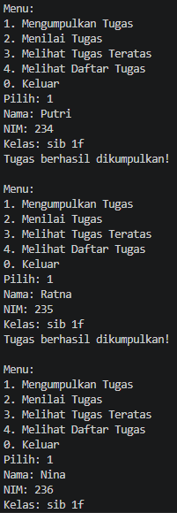
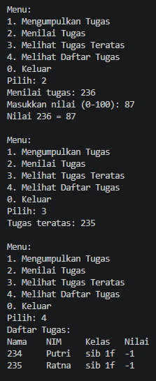

# 2.1.2 Verifikasi Hasil Percobaan

## 1. Lakukan perbaikan pada kode program, sehingga keluaran yang dihasilkan sama dengan verifikasi hasil percobaan! Bagian mana yang perlu diperbaiki?

(a) Constructor salah urutan parameter > yang benar -> Mahasiswa21 mhs = new Mahasiswa21(nim, nama, kelas);
(b) Logika pop() dan peek() salah > yang benar -> if (!isEmpt())
(d) Data nilai tidak ditampilkan > yang benar -> System.out.println(stack[i].nama + "\t" + stack[i].nim + "\t" + stack[i].kelas + "\t" + stack[i].nilai);

## 2. Berapa banyak data tugas mahasiswa yang dapat ditampung di dalam Stack? Tunjukkan potongan kode programnya!
Kapasitas Stack ditentukan oleh constructor
public StackTugasMahasiswa21(int size) {
    this.size = size;
    stack = newMahasiswa                                                
Jadi, jumlah data maksimal = size21[size];
} 

## 3. Mengapa perlu pengecekan kondisi !isFull() pada method push? Kalau kondisi if-else tersebut dihapus, apa dampaknya?
agar tidak terjadi ArrayIndexOutOfBoundsException dan agartidak menimpa data di luar kapasitas array

